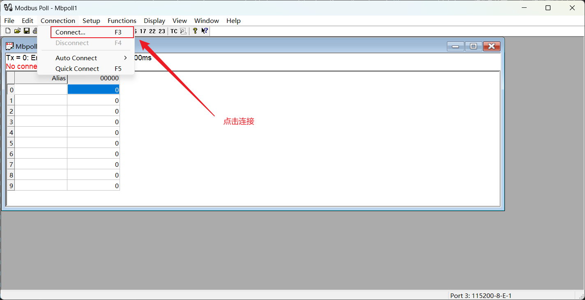
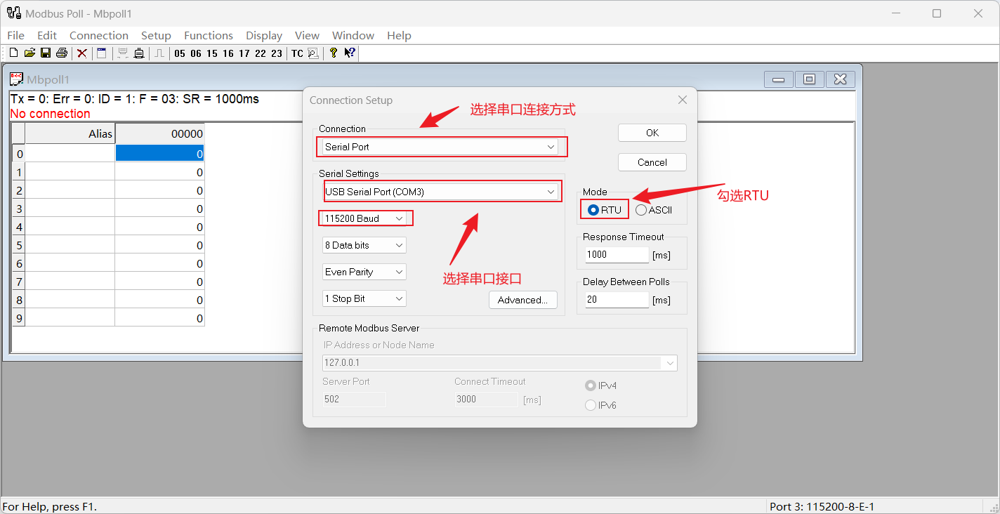
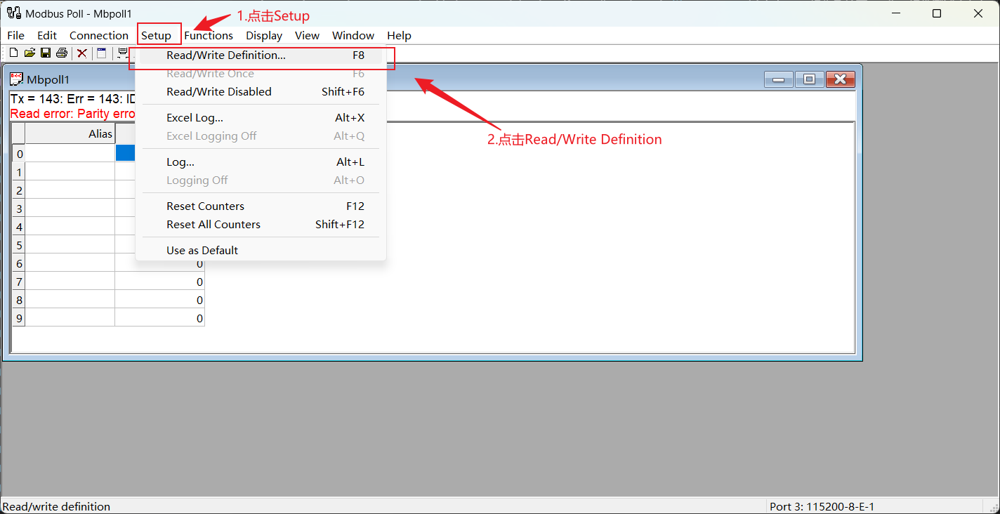
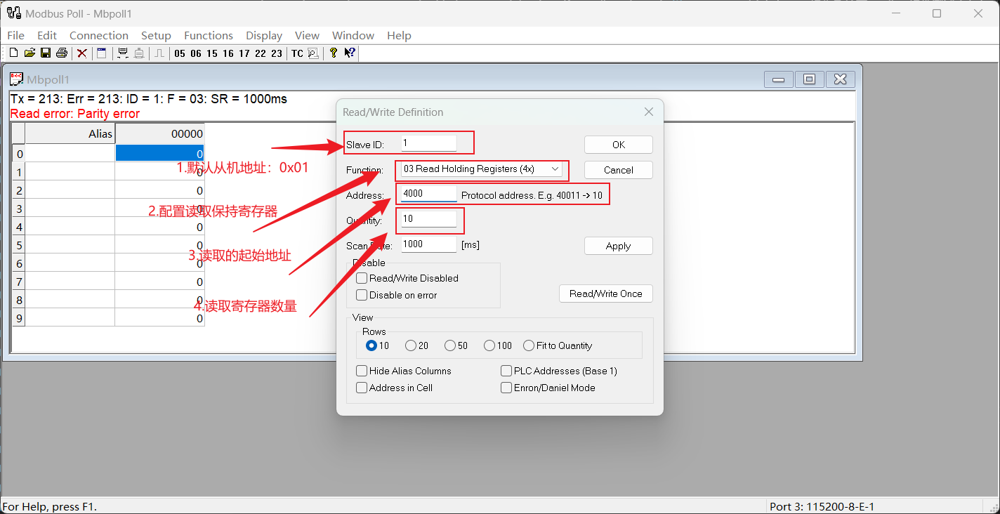
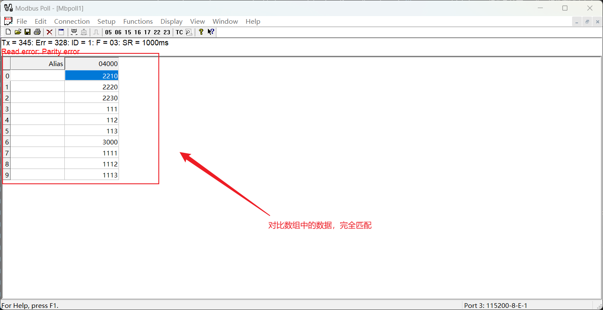
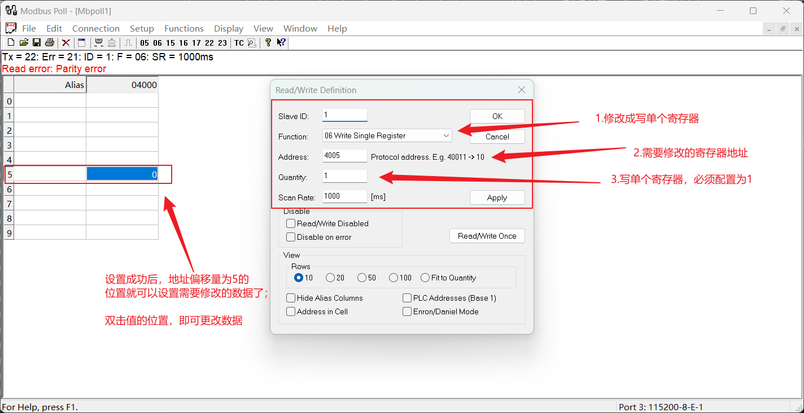

```bash
create_at：2025/11/14
aliases：验证Modbus通讯协议
IDE：RT-Thread Studio v2.2.9 或更高版本
RTT 版本：v4.1.0 或更高
芯片：STM32F407IGT6
硬件：串口引脚已连接（e.g., UART3: PB10-TX, PB11-RX）
```

# <font size=4>RTT操作系统下Modbus组件测试</font>
## <font size=3>一、RTU-SLAVE测试方法</font>
<font size=2>

在`modbus_slave_task.c`中实现了一个完整的 `RT-Thread + Modbus RTU 从站`示例,包含：
- 串口配置（uart3, 115200）
- 保持寄存器数组（地址从 4000 开始，共 29 个）
- `read_hold` / `write_hold` 回调
- 从站线程 + 状态机循环

| 项目     | 推荐工具                             |
| -------- | ------------------------------------ |
| 硬件     | USB 转 RS485 模块                    |
| 主站软件 | Modbus Poll                          |
| 串口助手 | XCOM、SSCOM、PuTTY（辅助查看原始帧） |
| 接线     | A → A, B → B, GND → GND              |

### 步骤1：烧录并运行代码
1. 确保你的开发板已烧录本次例程代码;
2. 上电后，通过`串口日志`看到：`[mb.rtu.slave] modbus rtu slave start`说明从站线程已启动，状态机在运行;

### 步骤2：使用 Modbus Poll 测试读取功能

**1. 打开 Modbus Poll → Connection → Connect**




**2. 配置寄存器读取,点击 Setup → Read/Write Definition**




**3.解析**

```C
#define MB_REG_ADDR_BEGIN   4000    //寄存器起始地址

static uint16_t regs[] = {//寄存器数据-一共25个
    2210, 2220, 2230, 111,  112,  113,  3000, 1111, 1112, 1113, 600,
    201,  202,  203,  4000, 8008, 9009, 2001, 2002, 2003, 2004, 101,
    102,  103,   104, 1111, 1112, 1113, 1114
};

```
在例程代码中，设置了寄存器数据以及寄存器起始地址，按照上述步骤进行配置后，读取前10个寄存器数据，可以得到预期结果如下：



### 步骤3：使用 Modbus Poll 测试写入功能

**1. 用Modbus Poll写单个寄存器**

```bash
- 右键某个地址 →  Read/Write Definition → Write Single Register
- 输入：
- Address: 4005
- Value: 996
→ 成功后，地址 4005 的值变为 996
```



</font>


## <font size=3>二、RTU-MASTER测试方法</font>
<font size=2>


</font>


